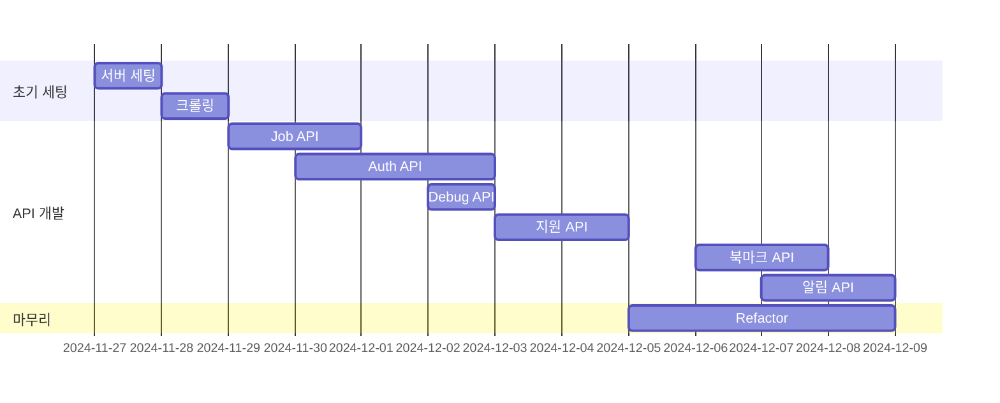
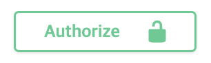

# 24-02-WSD-Assignment-03
### 구인구직 백엔드 서버 만들기 (사람인..?)
## 프로젝트 기본 정보
- 웹 크롤링 이해 및 적용: 사람인에서 채용 공고 데이터를 크롤링하여 수집.
- 데이터베이스 설계: 크롤링한 데이터를 SQL (MySQL) 또는 NoSQL (MongoDB)로 구조화.
- REST API 개발: 크롤링한 데이터를 기반으로 한 다양한 기능의 API 개발 및 회원 인증 기능 구현.
- 문서화 및 인증: Swagger를 이용한 API 문서화와 JWT 기반 인증 시스템 적용.
- 클라우드 배포: JCloud를 사용하여 백엔드 서버를 배포.




## 기술 스택


## Swagger 접속



- 접속 후 Authorize 칸에  JWT Access Token, CSRF Token을 기입해야 함


## 설치 및 실행 가이드
~~~
Node.js 설치
npm 설치
mongoDB 설치 및 실행
Redis 설치 및 실행
~~~
~~~
.env 설정
PORT=
MONGO_URI=
REDIS_HOST=
REDIS_PORT=
JWT_SECRET=
REFRESH_TOKEN_SECRET=
COOKIE_SECRET=
~~~
~~~
$ npm install
$ npm start
~~~

## Jcloud 접속시
session1로 접속시 현재 실행중인 터미널로 접속할 수 있음
~~~
$ tmux attach -t session1
~~~

## MVCS 패턴 적용
### 1. Model
-   **역할**:
    - 데이터베이스와 직접 소통하며, 데이터의 구조와 상태를 정의
    - 실제 데이터를 표현하기 위한 스키마를 정의
    ```
    Job.js
    Company.js
    User.js
    Application.js
    Bookmark.js
    Token.js
    LoginHistory.js
    Notification.js
    ```
### 2. View
- **역할**:
    - 사용자에게 데이터를 보여주는 UI레이어
    - API 기반 벡엔드에선 json응답이 뷰의 역할을 대신
    - 프론트에선 HTML/CSS/JS 파일이 뷰 역할

### 3. Controller
- **역할**:
    - 사용자의 request를 받아 필요한 데이터를 Model에서 가져오고 View로 전달
    - 비즈니스 로직은 처리하지 않으며, **요청/흐름**만 관리
    ```
    application.controller.js
    auth.controller.js
    bookmark.controller.js
    job.controller.js
    notification.controller.js
    ```
### 4. Service
- **역할**:
    - 비즈니스 로직과 데이터의 처리 세부 사항을 캡슐화
    - 복잡한 데이터 처리나 여러 Model을 사용하는 작업을 수행
    - Controller가 Service를 호출하고, Service는 Model과 소통
    ```
    application.service.js
    auth.service.js
    bookmark.service.js
    job.service.js
    notification.service.js
    ```
## MVCS의 흐름
요청(Request) 흐름:
```
User -> Controller -> Service -> Model
```
응답(Response) 흐름:
```
User <- View <- Controller <- Service <- Model
```


## 인증 및 보안 구현

- 인증 미들웨어: middlewares/authenticateToken.js
  - Access Token 발급 및 검증 : 
  - JWT 기반 인증: 
  - Refresh Token 구현
  - 토큰 갱신 메커니즘 (필수)
- 토큰 블랙리스트 관리 : utils/tokenBlacklist.js
<!-- 권한 검사 미들웨어 -->
- 입력 데이터 및 파라미터 검증: middlewares/validators.js
- Rate Limiting: [express-rate-limit (50 회/분)](https://express-rate-limit.mintlify.app/overview)
- XSS 방지: [xss-clean](https://www.npmjs.com/package/xss-clean)
- CSRF 보호: [csurf](https://github.com/expressjs/csurf)
- 암호화 처리: [bcrypt](https://github.com/kelektiv/node.bcrypt.js)

## REST API 개발
### 회원 관리 관련 API
- [x] 회원 가입/로그인 API ✅ 2024-12-07
	- [x] 회원 가입 (POST /auth/register) ✅ 2024-12-03
		- [x] 이메일 형식 검증 ✅ 2024-12-07
		- [x] 비밀번호 암호화 (Base64) ✅ 2024-12-03
		- [x] 중복 회원 검사 ✅ 2024-12-03
	    - [x] 사용자 정보 저장 ✅ 2024-12-03
	- [x] 로그인 (POST /auth/login) ✅ 2024-12-07
		- [x] 사용자 인증 ✅ 2024-12-03
		- [x] JWT 토큰 발급 ✅ 2024-12-03
		- [x] 로그인 이력 저장 ✅ 2024-12-07
		- [x] 실패 시 에러 처리 ✅ 2024-12-07
	- [x] 토큰 갱신 (POST /auth/refresh) ✅ 2024-12-07
		- [x] Refresh 토큰 검증 ✅ 2024-12-03
		- [x] 새로운 Access 토큰 발급 ✅ 2024-12-03
		- [x] 토큰 만료 처리 ✅ 2024-12-03
	- [x] 회원 정보 수정 (PUT /auth/profile) ✅ 2024-12-07
		- [x] 인증 미들웨어 적용 ✅ 2024-12-07
		- [x] 비밀번호 변경 ✅ 2024-12-04
		- [x] 프로필 정보 수정 ✅ 2024-12-04
- [x] 회원 정보 조회 API ✅ 2024-12-07
- [x] 회원 탈퇴 API ✅ 2024-12-04
	
### 채용 공고 관련 API
- [x] 공고 목록 조회 (GET /jobs) ✅ 2024-12-07
	- [x] 페이지네이션 처리 (필수) ✅ 2024-12-07
		- [x] 페이지 크기: 20 ✅ 2024-12-03
		- [x] 정렬 기준 제공 ✅ 2024-12-07
	- [x] 필터링 기능 (필수) ✅ 2024-12-07
		- [x] 지역별 ✅ 2024-12-03
		- [x] 경력별 ✅ 2024-12-03
		- [x] 급여별 ✅ 2024-12-03
		- [x] 기술스택별 ✅ 2024-12-03
		- [x] 학력별 ✅ 2024-12-03
	- [x] 검색 기능 (필수) ✅ 2024-12-07
		- [x] 키워드 검색 ✅ 2024-12-03
		- [x] 회사명 검색 ✅ 2024-12-07
		- [x] 포지션 검색 ✅ 2024-12-07
- [x] 공고 상세 조회 (GET /jobs/:id) ✅ 2024-12-07
	- [x] 상세 정보 제공 ✅ 2024-12-03
	- [x] 조회수 증가 ✅ 2024-12-03
	- [x] 관련 공고 추천 ✅ 2024-12-03
- [x] 채용 공고 등록 API ✅ 2024-12-07
- [x] 채용 공고 수정 API ✅ 2024-12-08
- [x] 채용 공고 삭제 API ✅ 2024-12-07

### 지원 관련 API
- [x] 지원하기 (POST /applications) ✅ 2024-12-07
	- [x] 인증 확인 ✅ 2024-12-04
	- [x] 중복 지원 체크 ✅ 2024-12-04
	- [x] 지원 정보 저장 ✅ 2024-12-04
	- [x] 이력서 첨부 (선택) ✅ 2024-12-07
- [x] 지원 취소 (DELETE /applications/:id) ✅ 2024-12-07
	- [x] 인증 확인 ✅ 2024-12-04
	- [x] 취소 가능 여부 확인 ✅ 2024-12-04
	- [x] 상태 업데이트 ✅ 2024-12-04

- [x] 지원 내역 조회 (GET /applications) ✅ 2024-12-07
	- [x] 사용자별 지원 목록 ✅ 2024-12-07
	- [x] 상태별 필터링 ✅ 2024-12-07
	- [x] 날짜별 정렬 ✅ 2024-12-04
- [x] 관심 등록 API ✅ 2024-12-07

### 북마크 API (/bookmarks)
- [x] 북마크 추가/제거 (POST /bookmarks) ✅ 2024-12-07
	- [x] 인증 확인 ✅ 2024-12-07
	- [x] 북마크 토글 처리 ✅ 2024-12-07
	- [x] 사용자별 저장 ✅ 2024-12-07
- [x] 북마크 목록 조회 (GET /bookmarks) ✅ 2024-12-07
	- [x] 사용자별 북마크 ✅ 2024-12-07
	- [x] 페이지네이션 ✅ 2024-12-07
	- [x] 최신순 정렬 ✅ 2024-12-07


### 관리자 API
- [x] 지원자 조회 ✅ 2024-12-07
	- [x] 권한 확인 ✅ 2024-12-07
	- [x] 소속회사 체크 ✅ 2024-12-07
- [x] 지원 수락/거절 ✅ 2024-12-07
	- [x] 권한 확인 ✅ 2024-12-07
	- [x] 유효성 검사 ✅ 2024-12-07
	- [x] 상태 업데이트 ✅ 2024-12-07
- [x] 채용 공고 삭제 ✅ 2024-12-07
	- [x] 권한 확인 ✅ 2024-12-07
	- [x] 상태 업데이트 ✅ 2024-12-07

## d. 인증 및 보안 구현
- [x] JWT 기반 인증 ✅ 2024-12-07
	- [x] Access Token 발급 및 검증 (필수) ✅ 2024-12-04
	- [x] Refresh Token 구현 (가산점) ✅ 2024-12-04
	- [x] 토큰 갱신 메커니즘 (필수) ✅ 2024-12-07
	- [x] 토큰 블랙리스트 관리 (Optional) ✅ 2024-12-07
- [x] 보안 미들웨어 구현 ✅ 2024-12-07
	- [x] 인증 미들웨어 ✅ 2024-12-07
	- [x] 권한 검사 미들웨어 ✅ 2024-12-07
	- [x] 입력 데이터 및 파라미터 검증 ✅ 2024-12-04
	- [x] Rate Limiting (Optional) ✅ 2024-12-04
- [ ] 보안 강화 (Optional)
	- [x] XSS 방지 ✅ 2024-12-04
	- [x] CSRF 보호 ✅ 2024-12-04
	- [x] SQL Injection 방지 ✅ 2024-12-08
	- [x] 암호화 처리 ✅ 2024-12-04
- [ ] 고급 API 기능 구현
	- [x] 정렬 기능 ✅ 2024-12-05
	- [ ] 데이터 집계 API
- [ ] API 최적화 (Optional)
	- [ ] 응답 데이터 캐싱
	- [ ] N+1 문제 해결
	- [ ] 벌크 연산 처리
	- [ ] 부분 응답 처리
- [ ] API 테스트 (Optional)
	- [ ] 단위 테스트 작성
	- [x] 통합 테스트 작성 ✅ 2024-12-08
	- [ ] 엣지 케이스 테스트
	- [ ] 테스트 커버리지 측정

## f. 에러 처리 및 로깅
- [x] 에러 처리 구현 ✅ 2024-12-07
	- [x] 글로벌 에러 핸들러 (미들웨어 등) ✅ 2024-12-03
	- [x] 커스텀 에러 클래스 (인증 및 데이터 포맷 에러 필수 구현) ✅ 2024-12-03
	- [x] HTTP 상태 코드 매핑 ✅ 2024-12-03
	- [x] 에러 응답 포맷 통일 ✅ 2024-12-03
- [ ] 로깅 시스템 구축 (가산점)
	- [x] 요청/응답 로깅 ✅ 2024-12-03
	- [x] 에러 로깅 ✅ 2024-12-03
	- [ ] 성능 모니터링
	- [ ] 로그 레벨 관리
- [ ] 모니터링 시스템 (Optional)
	- [ ] 성능 메트릭 수집
	- [ ] 알림 시스템 구축
	- [ ] 로그 분석 도구 연동
	- [ ] 대시보드 구성